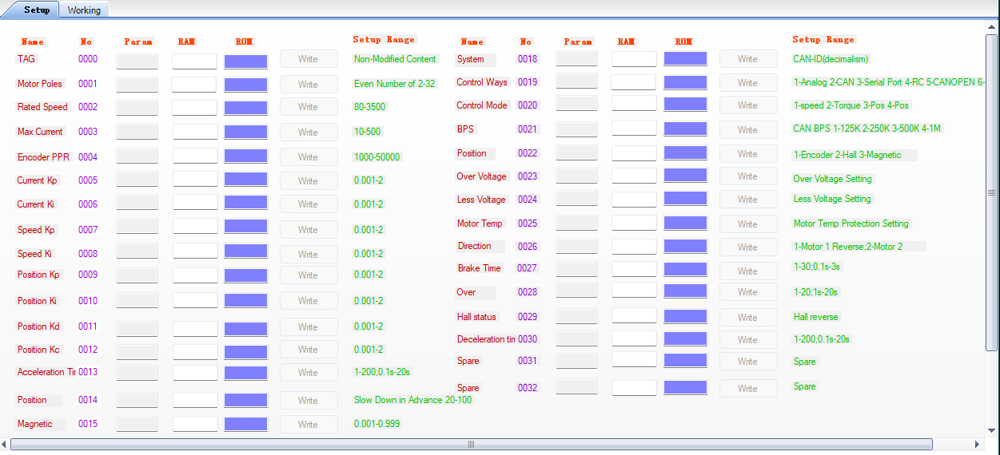
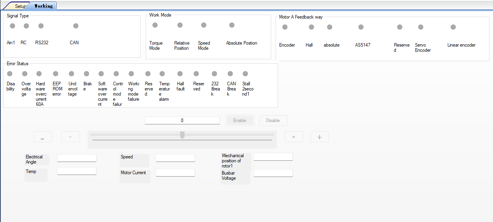

# Project outline

## Architecture

Should be a platformio-based c++ project for Teensy 4.1

It will communicate with the user over ethernet and TCP/IP, on static IP 192.168.1.126

Teensy should use flexcant4 libraries for canbus interaction, using CAN3

Should provide a web interface for the user to configure the attached Keya steering motor via CANBUS (CAN3)

The web interface should have two tabs. The first should resemble the layout in tab1.png. This page is for configuring the Keya steering motor and should allow the user to poll the existing configuration, update it, and send the new values to EEPROM.

The second tab is to drive the motor manually, to be used in testing

The CAN protocol is as follows:

All communication is sent via ID 0x06000591
Payload: [FA FA 00 00] (go into config mode, motor stops)
Payload: [BB BB 00 00 00 03 00 05] (set current limit to 5 amps)
Payload: [FA FA 00 08] (store to eeprom)
Payload: [FA FA 00 AA] (exit config mode)

Responses to these commands will show up as

uint8_t parameters[] = { 0xAA, 0xAA, 0x00, 0xID, 0x00, 0xREAD, 0x00, 0xVAL }; // this goes round reading  0 (parameter), 1 (ram) and 2 (read) so it takes a while as 2/read is last
ID: 0x181
Payload: [3] in parameters[] (labelled 0xID in above) refers to the parameter number in tab1.png
Payload: [5] in parameters[] (labelled 0xREAD in above) refers to 0 (parameter), 1 (ram) and 2 (read)
Payload: [7] in parameters[] (labelled 0xVAL in above) refers to the number read and displayed in the RAM column in tab1.png

Example:
If the max motor current (parameter ID 3) is 10 amps, then the values read would be:
0xAA, 0xAA, 0x00, 0x03, 0x00, 0x02, 0x00, 0x0A

